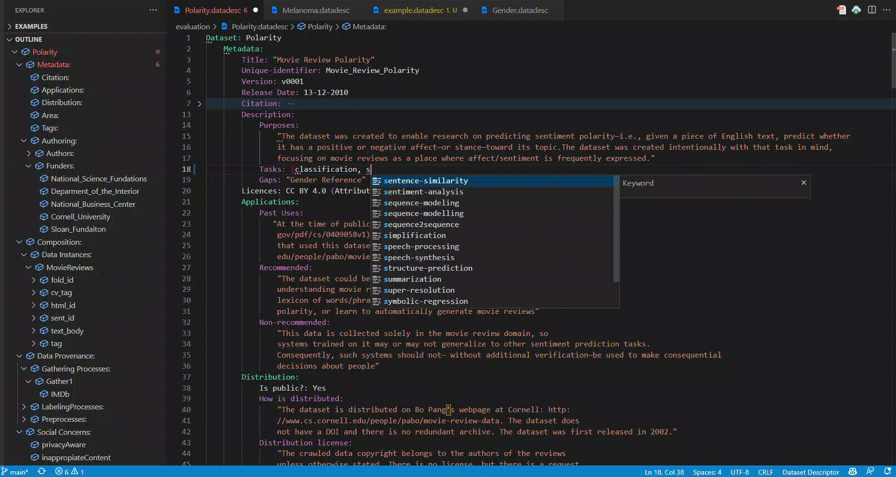

# Dataset-Descriptor
A Visual Studio Code language plugin to describe machine-learning datasets. This plugin helps you define your data's provenance, composition, and social concerns in a standard format.


## Using the plug-in

This work is still in a double-blind peer-review process. Therefore, the plugin is not published in the Visual Studio Code Market. Instead, a packaged release of the plugin is ready to be installed. Can be found at the root of the project. The specific file is Dataset-Descriptor-0.0.1.vsix.

Open your terminal (or the terminal inside the VSCode) and write this:

```code --install-extension Dataset-Descriptor-0.0.1.vsix```

Great! That's it.

Now go to /examples/evaluation and open a .datadesc file to see a working example of our preliminary evaluation.
Remember: by default, VSCode gives you auto-completion help by hitting CTRL + Space (or equivalent in MAC)



### Want to dive into language development?

If you want to contribute or dive into the plugin or the language, you may need extra steps. As Langium (the base framework of the plugin) is not stable, there are a few actions we need to do manually.

1 - "npm install" to install dependencies.

2 - Then go to /node_modules folder and delete "langium" and "langium-cli" folder

3 - Copy the folder "langium" and "langium-cli" from folder /packages to /node_modules

4 - Get the folder /packages/langium-vscode and paste it inside your VSCode extension folder (tipically <user home>/.vscode/extensions)
  
5 - Install de Langium plugin thourgh the UI of VSCode


## Testing the extensions under the hood

This repo comes with an already built-in config to debug. Just go to Debug in VSCode, and launch the Extension config. Please check your port 6009 are free.
  
For more information about how the framework works and how the language can be extended, please refer to https://github.com/langium/langium or the VSCode extension API documentation https://code.visualstudio.com/api


